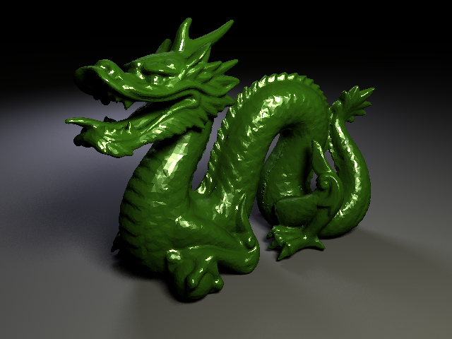
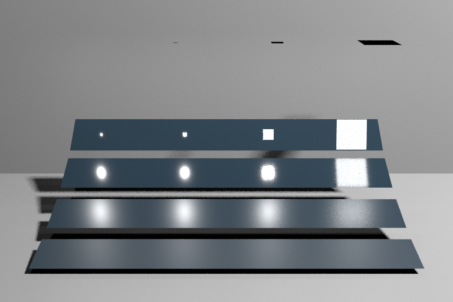

# Background

These are images from my raytracer/pathtracer using Nvidia OptiX and CUDA. 

# Standard Raytracer

The images below are rendered from a standard raytracer using blinn-phong shading model. Shadows are handled by shooting a ray from the intersection point to the light sources. If an object is in the path of the ray, then the point is shaded as a shadow.

This image uses only an ambient color and does not fully utilize the blinn-phong model. 

This image uses the diffuse portion of the shading model and you can see the shadows from the objects.

This image uses only the specular portion of the shading model. You can see the reflections off each object.

Here are some more images from more complicated scenes rendered with numerous objects in the scene. Additionally, the stanford dragon in the image below is constructed with 50,000 triangles.

# Pathtracer

The difference between a pathtracer and a raytracer is that a pathtracer can shoot multiple rays per bounce and averages the results from the rays whereas a raytracer shoots only a single ray per bounce. Since a pathtracer uses more rays, it creates more detailed and realistic images compared to that of a standard raytracer.

## Direct Lighting

The images below focus on direct lighting from area light sources. Direct lighting involves two rays and one bounce. The first ray is drawn through a pixel from the camera/eye to some point in the scene. Then the ray bounces and another is theoretically drawn to the light source. Since we are dealing with an area light source, realistically the secodn ray could land anywhere with the light source. So to model this accurately, we can sample random points from the light source to draw our second ray. 

The image below is rendered by using an analytical solution for quad light sources. There is no noise in the image, but analytical solution cannot be used in general since it does not consider shadows. For this project is used to create a reference image.

The image below uses 9 random samples from the light source to determine the color of the ground surface. You can see that it is noisy compared to the reference solution above. 

The image below uses 9 random samples as well, but the sampling is stratified. Stratified sampling in this case refers to dividing the area of the light source into 9 equal cells like a grid and taking a sample from each cell. This makes the resulting image more precise, but requires more calculations.

Here are some more images rendered with accurate physics-based direct lighting using stratified sampling. Notice how the shadows differ from those produce by the raytracer. The edges of the shadow are softer because part of the light passes through from sampling. 

## Indirect Lighting

## Importance Sampling

