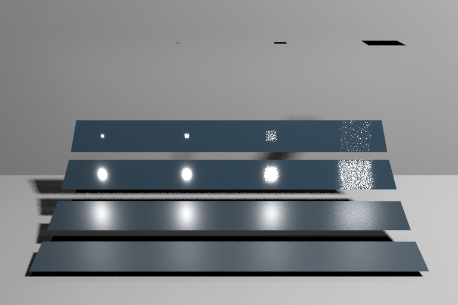
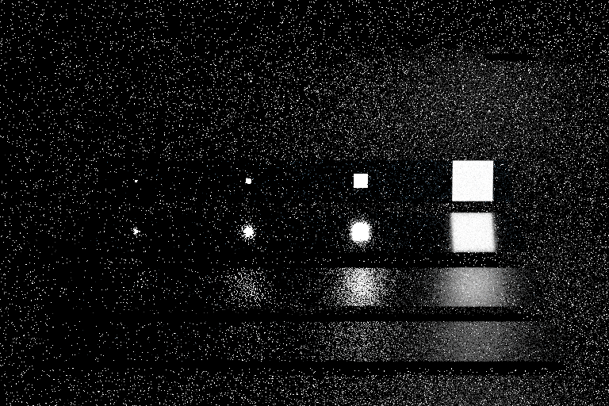

# Background

These are images from my raytracer/pathtracer using Nvidia OptiX and CUDA. 

# Standard Raytracer

The images below are rendered from a standard raytracer using blinn-phong shading model. Shadows are handled by shooting a ray from the intersection point to the light sources. If an object is in the path of the ray, then the point is shaded as a shadow.

This image uses only an ambient color and does not fully utilize the blinn-phong model.   

This image uses the diffuse portion of the shading model and you can see the shadows from the objects.   

This image uses only the specular portion of the shading model. You can see the reflections off each object.   

Here are some more images from more complicated scenes rendered with numerous objects in the scene. Additionally, the stanford dragon in the image below is constructed with 50,000 triangles.

# Pathtracer

The difference between a pathtracer and a raytracer is that a pathtracer can shoot multiple rays per bounce/intersection and averages the results from the rays whereas a raytracer shoots only a single ray per bounce/intersection. Since a pathtracer uses more rays, it creates more detailed and realistic images compared to that of a standard raytracer.

## Direct Lighting

The images below focus on direct lighting from area light sources. Direct lighting involves two rays and one bounce. The first ray is drawn through a pixel from the camera/eye to some point in the scene. Then the ray bounces which means that another ray drawn to the light source. Since we are dealing with an area light source, realistically the second ray could land anywhere with the light source. So to model this accurately, we can sample random points from the light source to draw our second ray. 

The image below is rendered by using an analytical solution for quad light sources. There is no noise in the image, but analytical solution cannot be used in general since it does not consider shadows. For this project is used to create a reference image.   

The image below uses 9 random samples from the light source to determine the color of the ground surface. You can see that it is noisy compared to the reference solution above.   

The image below uses 9 random samples as well, but the sampling is stratified. Stratified sampling in this case refers to dividing the area of the light source into 9 equal cells like a grid and taking a sample from each cell. This makes the resulting image more precise, but requires more calculations.   

Here are some more images rendered with accurate physics-based direct lighting using stratified sampling. Notice how the shadows differ from those produce by the raytracer. The edges of the shadow are softer because part of the light passes through from sampling. 

## Indirect Lighting

The images below focus on incorporating indirect lighting. Direct lighting is not sufficient in producing realistic images because light does not always bounce from the surface into the camera/eye. Light could bounce from several surfaces before ultimately reaching the eye. Because of this, we want to do random sampling to generate a new ray for each bounce. 

Since raytracing and pathtracing rays usually start from the camera or the eye, we do not necessarily know when it will hit a light source. Furthermore, for indirect lighting to work, a ray needs to eventually hit the light. If we have defined max depth or maximum bounces per generated ray, it means that an image will most likely never reach a light source and produce a colorless image. Inorder to increase the probability of hitting a light source, we can increase the number of rays we shoot through a pixel and take the average resulting color. This will also help smooth out jagged edges (aliasing). 

The image below samples 64 rays per pixel with a maximum depth of 5. For every bounce, the next direction of the ray is determined randomly and uniformly from the hemisphere (uniform hemisphere sampling). Even though we are sampling many rays per pixel, our shading equation only produces color if the rays hit the light so the image still remains noisy.   

To reduce the noise in the previous image we can combine direct and indirect lighting. At each bounce we calculate the direct lighting contribution to the color and use uniform hemisphere sampling to determine the next direction of the ray which acts as our indirect lighting component. This method is called next event estimation(NEE). For direct lighting we only sample once unstratified from the area light since it produces adequate results.    

Up to this point, all of the images have been rendered with a maximum depth for each ray. This reduces accurarcy since rays are terminated prematurely. To fix this we can use a method called russian roulette. This randomly terminates rays based on how much energy they have. Rays with lower energy are more likely to be terminated than rays with high energy. To compensate for the random termination of rays, a boosting factor is necessary for surving rays. This boosting factor increases the longevity of high energy rays and accelerates the termination of low energy rays. 

The image belows is rendered with russian roulette and no maximum depth for rays. The image is brighter since more rays ultimately survive.   

Here is the stanford dragon rendered with next event estimation and russian roulette.   

## Importance Sampling

So far after each bounce of a ray we have been taking a uniform sample from the hemisphere to use as the next direction for the ray. We can produce better images if we change the way we sample the next direction of the ray.

The image below renders the scene using samples from a cosine distribution. This means that randomly sampled directions for each bounce will be sampled closer to the normal of the surface.   

The cosine sampling will still be very noisy depending on the materials used in the scene as show above. To reduce the noise in the image we need to consider the diffuse and specular components of objects in the scene.

The image below uses BRDF(bidirectional reflectance distribution function) sampling based on our modified phong BRDF(the formula that ultimately determines the color of the surface). The random samples will centered around the perfect reflected ray for more reflective surfaces. Otherwise, samples are centered around the normal for diffuse surfaces.   

The image below uses similar BRDF to the modified phong used above, but improves further on the realism. The method is called GGX BRDF which is currently used animation, VFX, and the gaming industry to accurately visualize specular reflections. GGX improves in realism by considering the microfacet nature of surfaces(surfaces are not completely smooth). GGX also improves upon reflections through a Fresnel reflection component. Fresnel reflections are the effect when surfaces tend to reflect more at grazing angles(when the viewing direction becomes more parallel with the surface).

### Multiple Importance Sampling
Returning back to BRDF sampling with our modified phong BRDF, we can improve realism with our reflections by combining both NEE and BRDF importance sampling methods. Earlier we mentioned how NEE uses indirect sampling aka BRDF sampling to determine the next direction for the ray. Let BRDF importance sampling refer to the first indirect lighting method we used where color was only produced when a ray hits a light source. There are merits to both methods. The benefit to NEE is that it produces noise free images for most the image but fails for more reflective surfaces. In contrast, BRDF importance sampling handles reflective surfaces better than NEE, but is very noisy everywhere else.
**NEE:**    

    
**BRDF:**

We can combine both these sampling methods, NEE and BRDF, so that BRDF is emphasized on reflective portions of the scene and NEE is emphasized everywhere else. This method is called multiple importance sampling(MIS) and is simpler in theory, but much more difficult to implement.

The image below uses MIS to combine both NEE and BRDF sampling methods.   

Here is a scene of the stanford dragon again using MIS and russian roulette. 

# Acknowledgments

The images shown here are produced for the homework assignments of CSE 168 at UCSD Fall 2021 taught by Professor Ravi Ramamoorthi.
